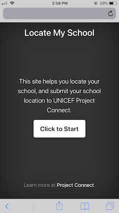
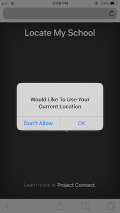
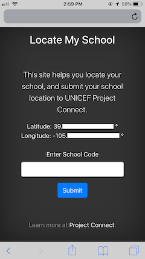
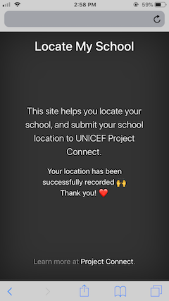

# Locate My School - English version

One-page website utility that records the GPS location of the website visitor. It uses the following components:

* [Geolocation API](https://developer.mozilla.org/en-US/docs/Web/API/Geolocation_API): the user is asked for permission to report location information.
* [Bootstrap Cover Template](https://getbootstrap.com/docs/4.5/examples/cover/) for a one-page website.
* [jamiewilson/form-to-google-sheets](https://github.com/jamiewilson/form-to-google-sheets) to submit a form to a Google Spreadsheet

## Installation

Just place the two files `index.html` and `cover.css` in any folder of a webserver. All code is client-side javascript.

Alternatively, clone this repository on GitHub, and use [GitHub Pages](https://pages.github.com/) to host your website.

## Screenshots

## License

This code is licensed under the [Apache 2.0 license](LICENSE), following the license of the [form-to-google-sheets](https://github.com/jamiewilson/form-to-google-sheets) subcomponent.
